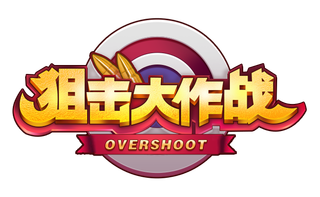

# OVT Introduction

OVT is the embedded fungible token of the game 'Overshoot'. It currently utilizes DotWallet's badge service as the underlying technique. 

There is no pie chart for OVT distribution, no pre-sale, no initial offering, no developer reserved. Every single unit of OVT will be distributed in-game. It's distributed when the player does something notably in-game, which is used as an effective incentive method. The player can use OVT to purchase our NFT items like weapons, bullets, accessories, both in the in-game market and the platform market.

The game is launched 2 months ago on 2020-12-01, with OVT enabled and issued from day 1, long before the token-mania recently in BSV apps. We are relatively cautious to use it in different scenarios. 

On one hand, in our future games, OVT can be used to get early accessing of new games and new contents, to trade NFT items from different games, to airdrop special NFT items with a fixed amount of supply. With statistics from the OVT distribution changes in these month, we have a precious way to filter our 'platinum' users, and seed users, and active market participants. And then we can work with them to improve our product in multiple ways. We can even distribute our earned BSV to those addresses as profit sharing continously.

On the other hand, we hope to encourage longterm interaction between SatoPlay and our fans, not shortterm pump-and-dump. So we need to carefully choose our collaborator to avoid unnecessary liquidity to overdraft our longterm development by money-absorbing operations in market from whales.

----------------------

- written on 2021-02-22 
- by Gu Lu

